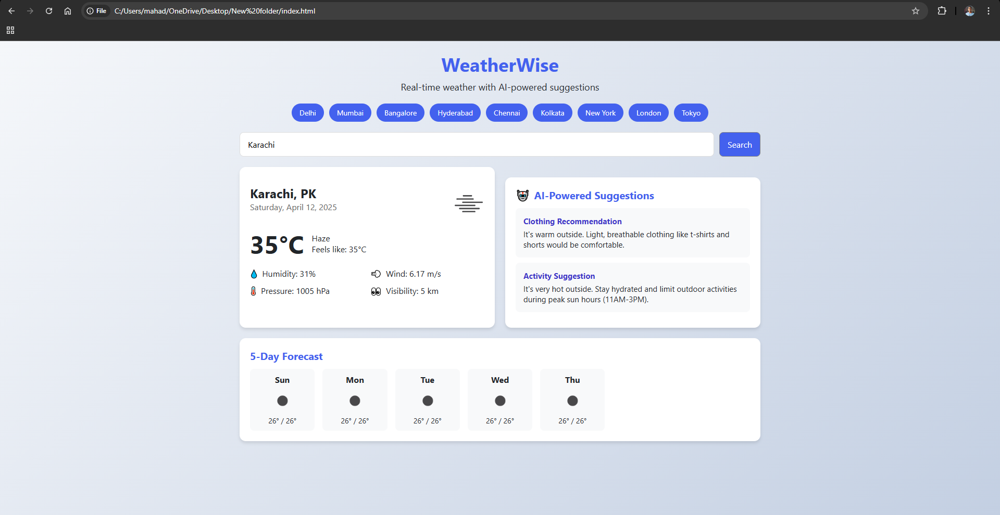

# 🌤️ WeatherWise

**WeatherWise** is an AI-powered weather web application that provides real-time weather updates and smart suggestions based on current conditions. It’s built with a modern responsive UI and supports multiple cities with quick search functionality.

## Features

- Real-time weather data using OpenWeatherMap API
- Support for multiple cities (Karachi, Delhi, Mumbai, New York, etc.)
- AI-powered suggestions for:
- Clothing based on weather
- Outdoor activity recommendations
- 5-day forecast overview
- Responsive design for desktop and mobile
- Search bar to look up any city

---

## Technologies Used

- HTML5
- CSS3
- JavaScript (Vanilla JS)
- OpenWeatherMap API

